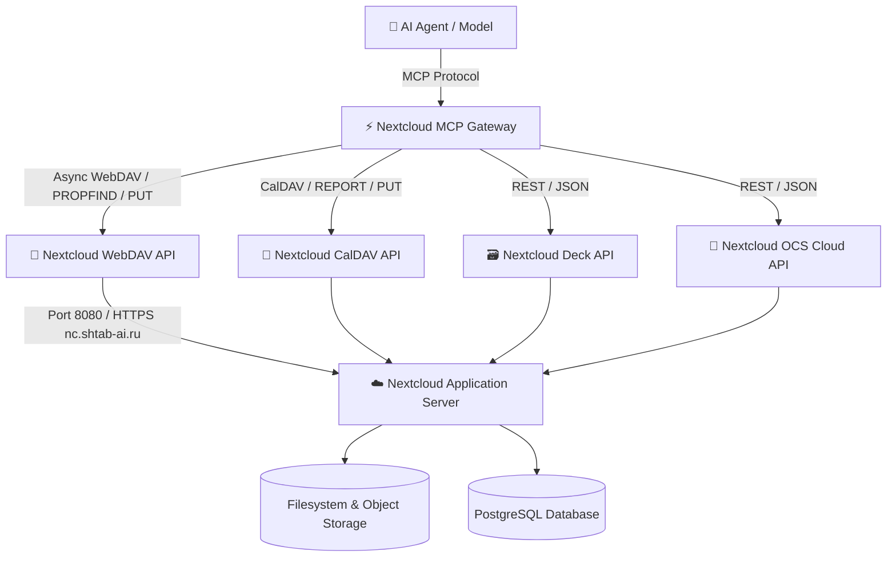
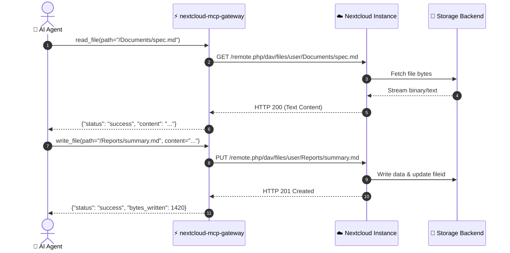

# ☁️ Architecture Documentation: Nextcloud MCP Gateway

`nextcloud-mcp-gateway` provides an asynchronous Data Plane Model Context Protocol (MCP) bridge into Nextcloud, enabling AI agents to read, write, organize, and inspect user storage and documentation.

---

## 🏗 High-Level Architecture

---

## 🔄 Sequence Workflow: File Operations

---

## 🔒 Security & Authentication

* **WebDAV Scoping:** Requests are securely scoped to authenticated user folders (`/remote.php/dav/files/{user}/`).
* **Basic Auth & App Passwords:** Uses generated Nextcloud App Passwords without exposing root account credentials.
* **Error Containment:** Safely catches HTTP 401/403/404, returning structured JSON error payloads to prevent agent crashes.
