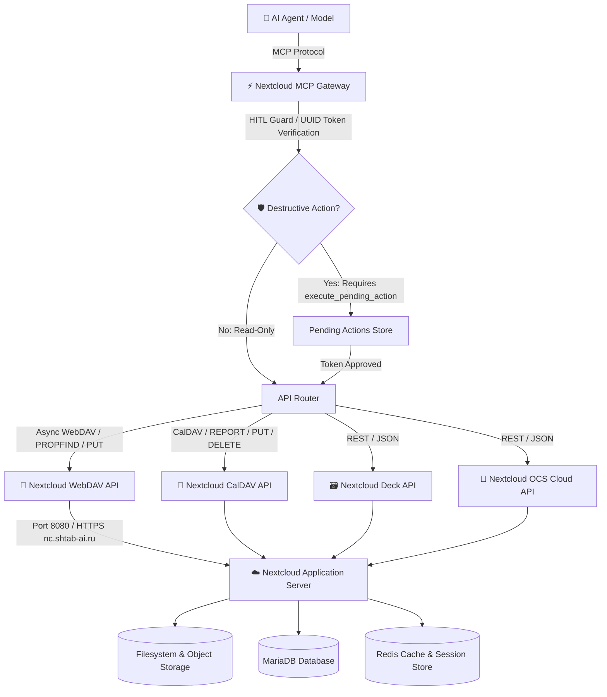
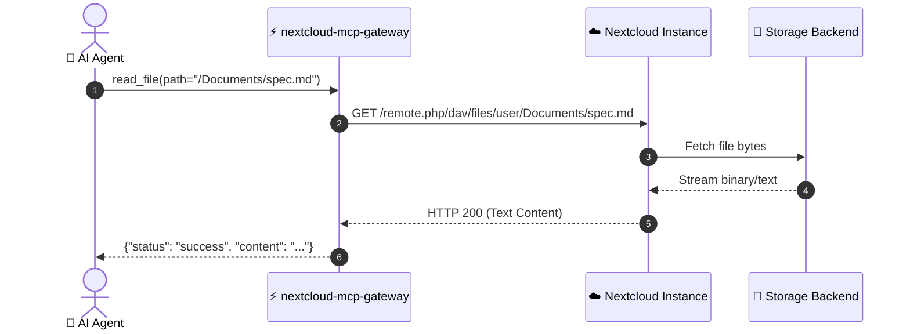
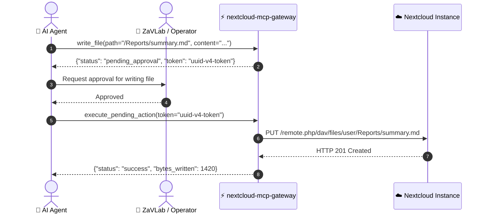

# ☁️ Architecture Documentation: Nextcloud MCP Gateway

`nextcloud-mcp-gateway` provides an asynchronous Data Plane Model Context Protocol (MCP) bridge into Nextcloud, enabling AI agents to read, write, organize, and inspect user storage, Kanban tasks (Deck), and calendar events (CalDAV).

---

## 🏗 High-Level Architecture

---

## 🔄 Sequence Workflows

### 1. Read Operations (Direct Execution)

### 2. Destructive Operations (Human-In-The-Loop / HITL Guard)

---

## 🔒 Security & Authentication

* **WebDAV Scoping:** Requests are securely scoped to authenticated user folders (`/remote.php/dav/files/{user}/`).
* **Basic Auth & App Passwords:** Uses generated Nextcloud App Passwords without exposing root account credentials.
* **HITL Guarded Actions:** Destructive operations (`write_file`, `delete_file`, `create_folder`) are protected by single-use UUID validation tokens.
* **Error Containment:** Safely catches HTTP 401/403/404, returning structured JSON error payloads to prevent agent crashes.
