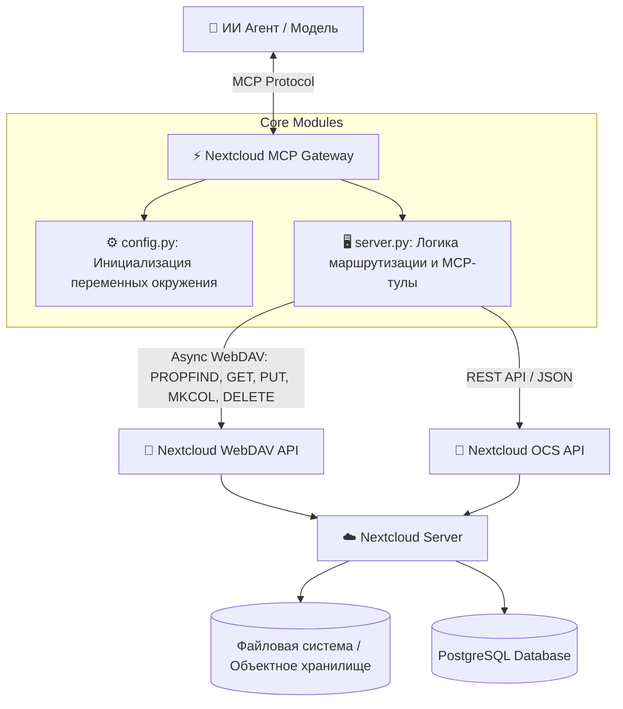

# Архитектура Nextcloud MCP Gateway

Этот документ описывает внутреннее устройство и архитектуру шлюза `nextcloud-mcp-gateway`, который обеспечивает асинхронное взаимодействие между ИИ-агентами (по протоколу MCP) и платформой Nextcloud.

## 🏗 Высокоуровневая архитектура и потоки данных

## 🧠 Логика под капотом

### Ключевые модули

1. **`config.py` (Конфигурация и окружение)**
   - Модуль инициализирует класс `NextcloudConfig`, который считывает настройки из переменных окружения.
   - Отвечает за генерацию корректных базовых URL-адресов для `WebDAV` (через `/remote.php/dav/files/{user}/` или `/remote.php/webdav`) и `OCS API` (`/ocs/v1.php/cloud`).
   - Содержит логику обработки аутентификационных данных (базовая аутентификация пользователя и пароля приложения).

2. **`server.py` (Основной сервер)**
   - Построен на базе библиотеки `fastmcp` (или `mcp.server.fastmcp`).
   - Инициализирует MCP-сервер `nextcloud-mcp-gateway`.
   - Регистрирует инструменты (`tools`), которые будут доступны ИИ-агенту.
   - Все запросы выполняются асинхронно через HTTP-клиент `httpx.AsyncClient`, что предотвращает блокировки при долгих ответах от Nextcloud.

### Алгоритмы обработки и парсинга данных

- **Парсинг XML (WebDAV `PROPFIND`):**
  Метод `list_files` использует WebDAV команду `PROPFIND` для получения структуры директорий. Ответ приходит в формате XML. Внутри функции используется `xml.etree.ElementTree` для безопасного разбора ответа:
  - Извлекаются пространства имен (`DAV:` и `http://owncloud.org/ns`).
  - Происходит итерация по узлам `d:response` и парсинг таких полей, как `d:getlastmodified`, `d:getcontentlength`, и проверка на директорию с помощью `d:resourcetype/d:collection`.

- **Управление путями:**
  Функция `normalize_path(path: str) -> str` осуществляет базовую санитизацию путей. Она удаляет лишние пробелы и гарантирует, что путь всегда начинается со слеша `/`. Это критично для корректного формирования WebDAV URL-адресов и предотвращения ошибок формирования запроса.

- **Обработка ошибок:**
  Все сетевые запросы завернуты в блоки `try/except`. В случае ошибок (например, 401 Unauthorized или 404 Not Found), сервер не падает, а возвращает агенту стандартизированный JSON-ответ с описанием ошибки (`{"status": "error", "error": "..."}`), что позволяет агенту корректно реагировать на ситуацию.

### Математические модели и сложные расчеты

На текущий момент проект выступает исключительно как Data Plane мост и не реализует собственных сложных алгоритмов трансформации данных или машинного обучения.

### TODO
> Добавить описание и реализацию модулей для вычисления эмбеддингов, векторного поиска и интеграции сложных математических моделей классификации данных при чтении документов из Nextcloud. (Функционал на данный момент не реализован).
